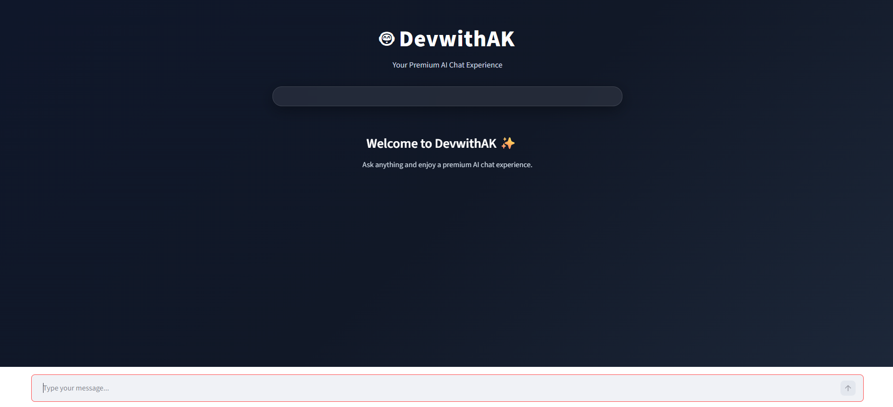
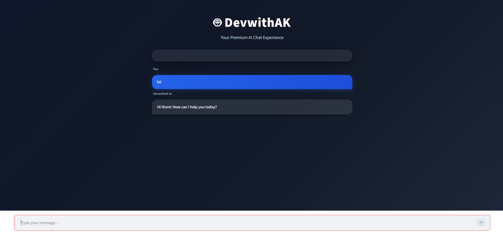

# 🤖 DevwithAK AI Chatbot

A modern **AI-powered chatbot** built using **Streamlit + Google Gemini API** with a beautiful glassmorphism UI.

---

## 🚀 Features

* 💬 Real-time AI chat (Gemini API)
* 🎨 Modern UI (glass effect + dark theme)
* ⚡ Fast & lightweight Streamlit app
* 🔄 Model fallback system (auto-switch)
* 🧠 Smart response handling
* 💾 Session-based chat history

---

## 🛠️ Tech Stack

* **Frontend/UI:** Streamlit
* **Backend:** Python
* **AI Model:** Google Gemini
* **Styling:** Custom CSS (Glassmorphism)

---

## 📂 Project Structure

```
CHATBOT/
│
├── app.py              # Main Streamlit app
├── requirements.txt   # Dependencies
├── README.md          # Project documentation
└── .env               # API key (not pushed to GitHub)
```

---
## 📸 Screenshots




## ⚙️ Installation & Setup

### 1️⃣ Clone the repository

```bash
git clone https://github.com/SafarwithAK/CHATBOT.git
cd CHATBOT
```

### 2️⃣ Install dependencies

```bash
pip install -r requirements.txt
```

### 3️⃣ Setup API Key

Create a `.env` file in the root folder:

```env
GEMINI_API_KEY=your_api_key_here
```

---

## ▶️ Run the App

```bash
streamlit run app.py
```

App will open in your browser:

```
http://localhost:8501
```

---

## 🌐 Deployment

You can easily deploy this app on:

* 🚀 Streamlit Community Cloud (Recommended)
* 🌍 Render
* ☁️ Railway

### Streamlit Deploy Steps:

1. Push code to GitHub
2. Go to Streamlit Cloud
3. Connect your repo
4. Add secret:

```
GEMINI_API_KEY = your_api_key
```

5. Click Deploy 🎉

---

## ⚠️ Important Notes

* `.env` file ko GitHub par upload **na karein**
* API key ko hamesha **secrets me store karein**
* Ensure `requirements.txt` present ho

---

## 🧩 Future Improvements

* 🔐 User login system
* 💾 Chat history database
* 🎤 Voice assistant integration
* 📱 Mobile responsive UI
* 🌍 Multi-language support

---

## 👨‍💻 Author

**Ajit Kumar**
GitHub: https://github.com/SafarwithAK

---

## ⭐ Support

Agar project pasand aaye to ⭐ star zaroor de!

---
